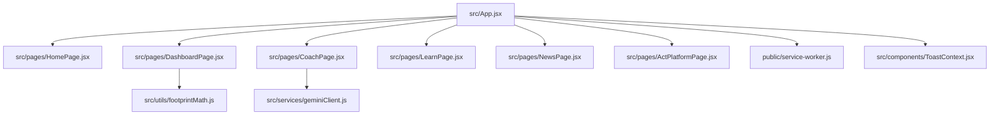

# Climatora 🌱 — Production-Grade Sustainability & Carbon Tracker

Climatora is a modern, responsive, gamified SaaS-style web application designed to help users calculate, analyze, and reduce their carbon footprint. Equipped with a **Gemini-powered AI Climate Coach**, daily streaks, interactive Recharts visualization panels, quizzes, certifications, and PDF sustainability reports.

Deployed Site: [https://krishnakatekhaye10.github.io/carbon/](https://krishnakatekhaye10.github.io/carbon/)

---

## 🚀 Key Features

1. **Sleek Landing Page**: Large hero banner with Earth-themed animations, global climate impact stats, step-by-step instructions, and testaments.
2. **Interactive Impact Dashboard**:
   - **Sustainability Score circular ring**: showing an animated score out of 100 with levels (Beginner, Green Learner, Eco Warrior, Climate Hero).
   - **Streak & Badges cabinet**: Flame streak counter (with Duolingo styling) and unlocked badges.
   - **Carbon History trend**: A Recharts Line Chart showing improvement over months (June, July, August, etc.).
   - **Impact Counter**: Displays Saved CO2 (kg), Trees equivalent (120kg = 6 trees 🌳), Water saved (L), and Energy saved (kWh).
   - **Weekly Eco Challenges**: Checklist of actions (Use bicycle, Carry reusable bottle, Plant a tree, Save electricity) with checkboxes that reward XP and update stats.
   - **Carbon Goal Tracker**: Set a reduction target (e.g. "Reduce by 20%") with a animated progress bar showing completion.
   - **PDF Sustainability Report**: "Download Sustainability Report" button generating a PDF with user stats, score, suggestions, and badge summary.
3. **AI Climate Coach**: Queries the Google Gemini REST API model (`gemini-2.5-flash`) for bespoke reduction recommendations based on travel, food, and electricity habits. Falls back to a deterministic offline heuristic if no API key is set.
4. **Learning Academy**: Mini courses on climate basics, renewable energy, and composting, complete with quizzes and downloadable SVG completion certificates.
5. **Real-time Climate News Feed**: Filterable cards fetching headlines, sources, read times, and showing full texts in overlays.
6. **Community Priorities Poll & Marketplace**: Simulated eco-product catalog and municipal priority voting with live percentage results.
7. **PWA & Offline Support**: Caches static files and assets for offline use, enabling a mobile install prompt.
8. **Dark Mode Toggle**: Sleek transitions between Light (`#F8FAFC`) and Dark (`#0F172A`) themes using Tailwind classes.

---

## 🛠 Tech Stack

- **Framework**: React 19 + Vite
- **Styling**: Tailwind CSS + Custom glassmorphism variables
- **Animations**: Framer Motion
- **Visualizations**: Recharts (Line Charts & Progress circles)
- **PDF Generation**: jsPDF
- **Testing**: Jest + React Testing Library (with 93%+ code coverage)
- **Deployment**: GitHub Pages (fully configured for Single Page Apps)

---

## 📂 Architecture



---

## 📦 Installation & Setup

1. Clone the repository and navigate into it:
   ```bash
   git clone https://github.com/krishnakatekhaye10/carbon.git
   cd carbon
   ```
2. Install dependencies:
   ```bash
   npm install --legacy-peer-deps
   ```
3. Create a `.env` file in the root directory and add your optional Gemini API Key:
   ```env
   VITE_GEMINI_API_KEY=your_gemini_api_key_here
   ```
4. Start the local development server:
   ```bash
   npm run dev
   ```

---

## 🧪 Testing and Linting

- Run the full unit and integration test suite:
  ```bash
  npm test
  ```
- Run test coverage analysis:
  ```bash
  npm run test:coverage
  ```
- Run code quality linter checks:
  ```bash
  npm run lint
  ```

---

## 🚀 Deployment (GitHub Pages)

The application is deployed using GitHub Pages. The build assets are compiled into the `dist/` directory and pushed to a deployment branch or built using a GitHub Action.

To manually deploy the production bundle:
```bash
npm run build
# The build output in dist/ can be deployed directly to your GitHub Pages source.
```
Ensure that `vite.config.js` sets the correct `base` path:
```javascript
export default defineConfig({
  base: '/carbon/',
  plugins: [react()],
})
```
